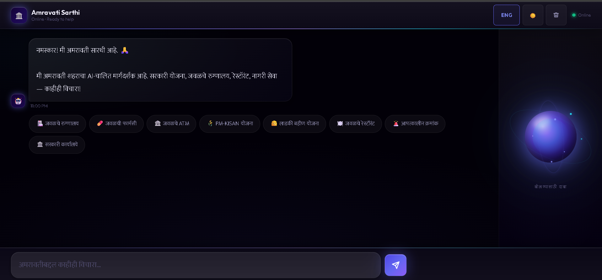
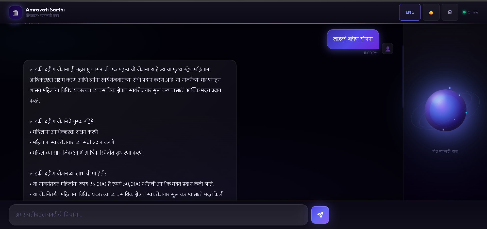

# 🏛️ Amravati Sarthi — अमरावती सारथी

> **AI-powered smart city assistant for the citizens of Amravati, Maharashtra.**  
> Ask anything — in Marathi or English — and get instant, accurate civic information.

<p align="center">
  <a href="https://amravati-sarthi.vercel.app">
    
  </a>
  
  <a href="https://amravati-sarthi.onrender.com/health">
    
  </a>

  
</p>

---

# 📌 Problem Statement

Citizens of Amravati (population 7 lakh+) struggle to access basic civic information:

- A farmer doesn't know how to apply for PM-KISAN
- A senior citizen can't find which government office handles pension complaints
- A family arriving late at night doesn't know which hospital is open
- Most existing tools are English-only and not built for local, ground-level needs

---

# 💡 Solution

**Amravati Sarthi** is a bilingual (Marathi + English) AI assistant that answers civic questions instantly using conversational AI and real-time location awareness.

Built for the **Build AI for Amravati Hackathon**, the platform combines:
- AI-powered chat
- location-based service discovery
- government scheme guidance
- multilingual voice interaction

to make civic help accessible for every citizen regardless of language, literacy level, or device.

---

# 📸 Landing Page

<p align="center">
  
</p>

---

# ✨ Key Features

| Feature | Description |
|---|---|
| 🤖 **AI Chat** | Natural language civic Q&A powered by Groq LLaMA 3.3 70B |
| 🗣️ **Bilingual Support** | Marathi + English input, output, and voice |
| 🎙️ **Voice Input** | Speak queries using Web Speech API |
| 🔊 **Voice Output** | AI responses read aloud using Speech Synthesis |
| 📍 **Nearby Services** | GPS-based hospitals, pharmacies, ATMs, restaurants |
| 🗺️ **Interactive Maps** | Leaflet + OpenStreetMap integration |
| 🧭 **Directions Support** | Opens Google Maps with live navigation |
| 📋 **Government Schemes** | PM-KISAN, Ladki Bahin, Ayushman Bharat, and more |
| 🚨 **Emergency Contacts** | Instant emergency numbers without AI processing |
| 🌙 **Dark / Light Mode** | Responsive UI with theme switching |
| ⚡ **Quick Suggestions** | One-tap civic query chips |
| 📶 **Auto Reconnect** | WebSocket reconnect handling |

---


# 📊 Project Highlights

- 🌐 Bilingual civic assistant for Marathi and English users
- 📍 Real-time GPS-based nearby service discovery
- 🧠 AI-powered conversational civic guidance
- 🗺️ Interactive map integration with live directions
- 🎙️ Voice-enabled interaction for accessibility
- ⚡ Real-time communication using WebSockets
- 🏛️ Built specifically for Amravati smart-city use cases
- 📦 Lightweight frontend with no heavy frameworks

---

# 📸 Chat Interface

<p align="center">
  
</p>

---

# 📸 Nearby Services & Maps

<p align="center">
  
</p>

---
# 📸 Marathi Language Support

<p align="center">
  
</p>

---

# 📸 Government Scheme Assistance

<p align="center">
  
</p>

# 🛠️ Tech Stack

| Layer | Technology |
|---|---|
| **Frontend** | HTML5, CSS3, Vanilla JavaScript |
| **Backend** | Python 3.11, FastAPI, WebSockets |
| **AI / LLM** | Groq API — LLaMA 3.3 70B Versatile |
| **Database** | Supabase PostgreSQL |
| **Maps** | Leaflet.js + OpenStreetMap |
| **Voice** | Web Speech API |
| **Location** | HTML5 Geolocation API |
| **Frontend Hosting** | Vercel |
| **Backend Hosting** | Render |


---

# 🗄️ Database Overview

The project uses Supabase PostgreSQL with structured civic datasets:

| Table | Description |
|---|---|
| `businesses` | Hospitals, ATMs, pharmacies, restaurants, and civic services |
| `schemes` | Government schemes with eligibility, benefits, and application guidance |

### Dataset Size
- 505+ real Amravati business/service records
- 11+ government schemes integrated

---


# 🏗️ System Architecture

<p align="center">
  
</p>

---

# 🔄 Application Flowchart

<p align="center">
  
</p>

---

# 🔄 How It Works

1. User opens the application
2. Browser requests location permission
3. GPS coordinates are stored locally
4. Frontend establishes WebSocket connection
5. User types or speaks a civic query
6. Backend detects the query intent
7. Query is routed to:
   - Emergency handler
   - Nearby services search
   - Government schemes
   - General AI response
8. AI response is returned to frontend
9. UI renders:
   - chat response
   - location cards
   - map pins
10. Speech synthesis reads the response aloud
---

# 🔒 Privacy & Accessibility

- User location is used only for nearby service recommendations
- No permanent storage of personal GPS data
- Voice interaction improves accessibility for semi-literate users
- Marathi support improves inclusivity for regional citizens
- Lightweight UI supports low-end devices and slower networks

---

# 📁 Folder Structure

```text
Amravati_Sarthi/
├── backend/
│   ├── __init__.py
│   ├── main.py
│   ├── ai_engine.py
│   ├── database.py
│   └── requirements.txt
│
├── frontend/
│   ├── scripts/
│   │   ├── index.html
│   │   └── app.js
│   │
│   └── styles/
│       └── main.css
│
├── assets/
│   ├── Landing-Page.png
│   ├── Chat-Interface.png
│   ├── Map-results.png
│   ├── System-Architecture.png
│   └── Flowchart.png
│
├── render.yaml
├── vercel.json
├── requirements.txt
└── .env
```
---
# 🔭 Future Scope

- 📱 Mobile application for Android and iOS
- 💬 WhatsApp integration for wider accessibility
- 🌐 Support for additional regional languages including Hindi
- 🏛️ Integration with live government APIs and civic databases
- 📢 Push notifications for emergency alerts and scheme deadlines
- 🧾 AI-powered grievance registration and tracking
- 🏪 Business owner self-registration portal
- 📶 Offline mode for low-connectivity rural areas
- 📊 Smart city analytics dashboard for authorities
- 🤝 Integration with municipal departments and smart-city infrastructure

---

# 🚧 Known Limitations

- Currently optimized specifically for Amravati district
- Voice recognition depends on browser compatibility
- Nearby services require GPS permission
- Government data updates are manually maintained
- Offline functionality is limited in the current version

---

# 📬 Contact

### Team: The Overfitters

- GitHub: https://github.com/Devendra0655
- Live Link: https://amravati-sarthi.vercel.app

---